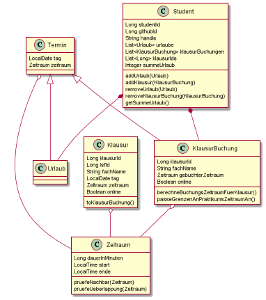
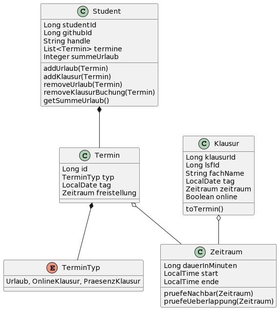

# Einführung

-   Verwaltungssystem für Studierende, Tutoren und Organisatoren während eines 3 wöchigen Praktikums

-   Urlaub und Klausuren anmelden und stornieren

# Anforderungen

Das angeforderte System muss vollständig die Regeln der Onion-Architektur erfüllen. Zudem erfolgt die Aggregatmodellierung nach den DDD Prinzipien.

# Kontextabgrenzung

Ein Student kann das System benutzen um im gegebenen Praktikumszeitraum Urlaubs -und Klausurbuchungungen bzw Stornierungen nach vorgegebenen Regeln durchzuführen.
In diesem Fall hat eine beliebige Klausur immer eine Zugehörigkeit zum Studenten.
Zusätzlich ist es möglich global Klausuren zu registrieren, deren Gültigkeit auch außerhalb des Studenten steht. 
Die Klausur wird vom System über eine externe Schnittstelle verifiziert.
Eine Klausur hat somit zwei fachliche Bedeutungen: Die der Klausurbuchung im Kontext des Studenten und sonst als unabhängies global Objekt.

# Lösungsstrategie

Das System baut auf große Teile der Spring Library für Java 1.17, darunter Spring Boot, Spring Data JDBC, Spring Boot Security und Thymeleaf. Als Build-System wird Gradle verwendet.
Die Anwendung folgt den Regeln der Onion-Architektur, wobei die interne Aggregatmodellierung nach den Prinzipien des Domain Driven Desings gebaut wird.
Ein wichtiges Kriterium ist die Unabhängikeit der Kernschicht (Domain). Demnach wurde diese bei der Entwicklung vorgezogen.
Während der Entwicklung wurde mob benutzt. Die Priorisierung einzelner Aufgaben erfolgte hauptsächlich nach Relevanz für das Endprodukt.

### Allgemeiner Lösungsansatz:
Ein Student besitzt Listen von Urlaubs- und Klausurbuchungen.
Diese werden zusätzlich im Domain-Objekt validiert, um einige Randfälle auszuschließen. Zum Beispiel bucht man eine Onlineklausur von 10:00 bis 11:00 und dann Urlaube jeweils um 09:00 - 10:00 und 11:00 - 11:30 bucht.
Storniert man jetzt die Klausur, entsteht nach Fall (2) eine ungültige Anordnung an Buchungen, und die Buchungen für den Tag werden gelöscht.
Einfachere Validation geschieht bereits im Infrastruktur-Layer über Spring Boot Form Validation.

Die Logik bezüglich des "Abschneidens" von Urlauben befindet sich der Einfachheit halber auch in der Student Klasse.

# Building Block View

### Fachlicher Kontext:

### Level 1:

### Level 2:

# Domain-Modellierung:

Anmerkung: Leider ist uns in der letzten Woche des Praktikums aufgefallen, dass insbesondere die Modellierung der Domänen-Objekte nicht ideal ist:
- Eine Abstraktion von `Urlaub` und `Klausurbuchung` als `Termine` hätte uns Duplikation und Kopplung an mehreren Stellen erspart (siehe UML-Diagramm)
- Somit wäre das `Zeitraum`-Objekt nur im `Termin` notwendig gewesen und
- die Datenbankanbindung deutlich intuitiver gewesen (nur einen Table für Termine, keine Many-To-Many Relation)
- Aktuell müssen die Klausurbuchungen manuell vom Service gesetzt werden, um die Konsistenz des `Student`-Aggregats zu wahren
- Der Service macht dies über die im `Student`-Objekt gespeicherten Liste an `klausurIds`

##Alternative Modellierung
